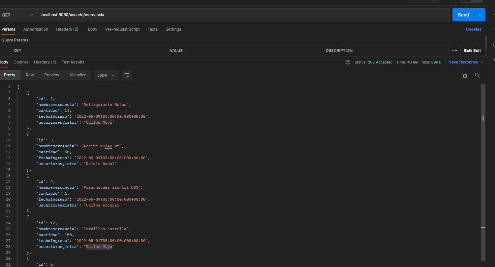

## Descripcion general del problema:
Siste,a de inventario para el sector automotriz donde se contole la mercancia que ingresa
y la que sale. El sistema debe permitir ergistrar nueva mercancia, editar y eliminar. 
Para registrar mercancia nueva se requiere tener en cuenta los siguientes datos:
Nombre producto, cantidad, fecha de ingreso, usuario que realiza registro, Restricciones:
no puede haber mas de una mercancia con el mismo nombre, la cantidad debe ser un numero entero,
la fecha de ingreso debe ser menor o iguall a la fecha actual.
Para editar mercancia debe tener las mismas condiciones de cuando se resgistra una nueva, aparte 
hay que registrar el usuario que hace la modificacion y la fecha.
Para eliminar mercancia, solo lo puede hacer el usuario que la registro -
Eñ soste,a tambien dene permitir mostrar por paantalla la mercancia registrada, los filtros de 
busqueda pueden ser por fechaa, usuario y/o nombre (se debe buscar minimo por un filtro).
Los usuarios que puedan ejectura las acciones deben estar registrrados con su nombre, edad, cargo,
y fecha de ingreso a la compañia.
Los posibles cargos son, Asesor de ventas, administrador y soporte, con la posibilidad de que se 
creen nuevos cargos a futuro.
Nota: no es necesario contar con un login para saber que usuario esta realizando las acciones en,
cada accion se puede elegir el usuario(previamente creaod en BD) en un menu desplegable.

---------------------------------------

### Pruebas unitarias

Las pruebas unitarias se ralizan en JUnit con Mockito y se pueden ver dentro del codigo tanto las de Controller y las de Service

----------------------------------------
### Base de datos.
---------------------------------------------

Se puede observar a continuacion el diagrama de clases de la base de datos con un suario y mercancia, donde no puede existir
una mercancia con el mismo nombre, y si no existe el usuario con el que se registrara la mercancia no se podra generar.

----------------------------------------------
### Script Usado

CREATE TABLE mercancia ( 
id serial not null,
nombremercancia VARCHAR(100) NOT NULL,
cantidad int NOT null,
fechaIngreso date not null,
usuarioresgistra VARCHAR(100) not null,
PRIMARY KEY (id)
);

CREATE TABLE usuario (   
id serial not null ,
nombre VARCHAR(100) NOT NULL,
cargo VARCHAR(100) NOT null,
fechaIngreso date not null,
edad int not null,
PRIMARY KEY (id)
);

CREATE TABLE rol (   
id serial not null ,
nombre VARCHAR(100) NOT null,
PRIMARY KEY (id)
);

-------------UNICAS-------------------------

ALTER TABLE mercancia ADD CONSTRAINT UK_mercancia UNIQUE (nombremercancia);
alter table usuario add constraint UK_usuario unique(nombre);
alter table rol add constraint UK_rol unique(nombre);

-------------FORANEAS-----------------------

ALTER TABLE mercancia ADD CONSTRAINT FK_usuario FOREIGN KEY (usuarioresgistra) REFERENCES usuario(nombre);
ALTER TABLE usuario  ADD CONSTRAINT FK_rol FOREIGN KEY (cargo) REFERENCES rol(nombre);

-------------POBLAR-------------------------

insert into rol (id,nombre)values(1,'Asesor de ventas');
insert into rol (id,nombre)values(2,'administrador');
insert into rol (id,nombre)values(3,'soporte');

insert into usuario (id,nombre,cargo,fechaingreso,edad)values(1,'Carlos Moya','administrador',current_date,22);
insert into usuario (id,nombre,cargo,fechaingreso,edad)values(2,'Rafale Nadal','soporte',current_date,36);
insert into usuario (id,nombre,cargo,fechaingreso,edad)values(3,'Carlos Alcaraz','administrador',current_date,19);
insert into usuario (id,nombre,cargo,fechaingreso,edad)values(4,'Milena Parra','Asesor de ventas',current_date,44);

insert into mercancia (id,nombremercancia,cantidad,fechaingreso,usuarioresgistra)values(2,'Refirgerante Motos',14,current_date,'Carlos Moya');
insert into mercancia (id,nombremercancia,cantidad,fechaingreso,usuarioresgistra)values(3,'Aceite 10/40 wt',50,current_date,'Rafale Nadal');
insert into mercancia (id,nombremercancia,cantidad,fechaingreso,usuarioresgistra)values(4,'Parachoques frontal DS3',1,current_date,'Carlos Alcaraz');
insert into mercancia (id,nombremercancia,cantidad,fechaingreso,usuarioresgistra)values(5,'Lamina polarisar ventanas',100,current_date,'Milena Parra');

------------------------------------------------------

## Test Postman

